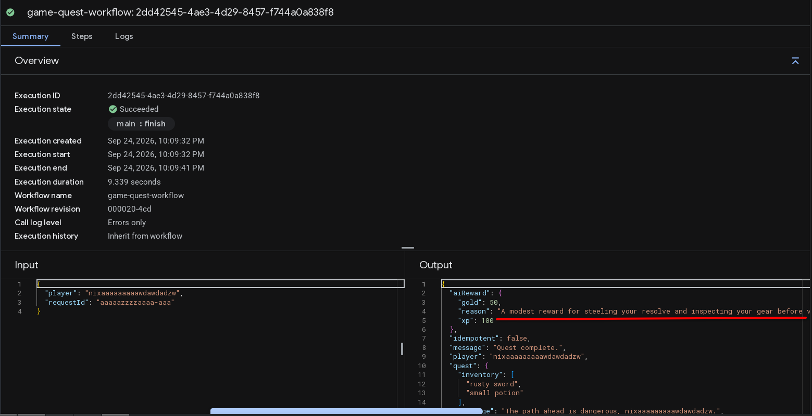
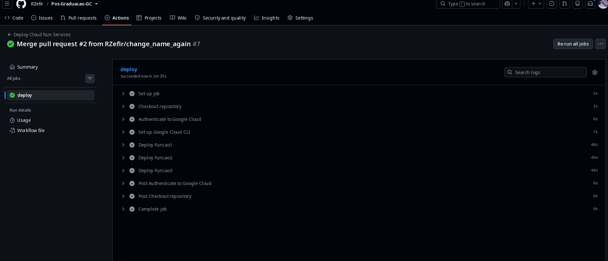
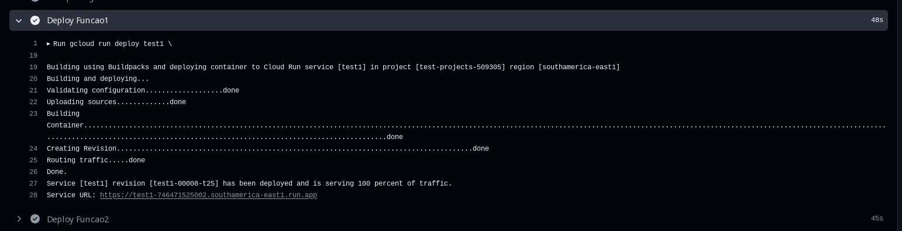
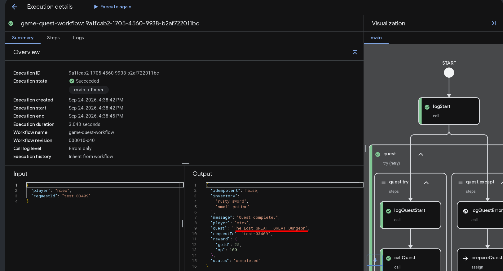

## CI/CD

O projeto utiliza GitHub Actions para realizar o deploy automático das
funções no Google Cloud Run.

O pipeline tem dois triggers: Um manual para caso precise fazer o re-deploy da master, e outro que é quando alguma branch é mergeada com a master.

### Pipeline

1. Checkout do código
    A gente pega o código do repo. Aqui não precisa de token porque é o próprio github actions
2. Autenticação no Google Cloud
    Autentifica no google cloud usando o .json da service account
3. Configuração do Google Cloud CLI
    Configura a ferramenta de cli da gcloud no runner do github actions 
4. Deploy da Função 1
5. Deploy da Função 2
6. Deploy da Função 3

Os serviços são implantados nas respectivas regiões configuradas no projeto. Eu errei uma região, então acabou ficando.

### Arquitetura

O projeto conecta quatro funções no Cloud Run através de um Workflow que orquestra a ordem de execução: Quest, Inventory, AI Reward e Reward.

Cada etapa depende do resultado da anterior. Se fosse coreografia, cada serviço ia ter que escutar evento de outro se não fosse, e a lógica de dependência ficaria espalhada em vez de centralizada num só lugar.

#### Serviços (Cloud Run)
Quest: recebe requestId e player, processa a missão do jogador e retorna o resultado da quest.

**inventory:** recebe o resultado da quest e atualiza/consulta o inventário do jogador, retornando os dados combinados.

**AI Reward:** recebe o player e o resultado do inventário, e usa o Gemini (via function calling) pra decidir quanto de gold e xp o jogador ganha.

**Reward:** recebe o resultado final (incluindo a recompensa decidida pela IA) e salva no Firestore, com checagem de idempotência por requestId.

#### Fluxo do Workflow
**logStart** - loga o início com requestId e player

**quest**  -  chama a função Quest
inventory - chama a função Inventory, passando o resultado da quest

**callAI** - chama a função AI Reward

**reward** - chama a função Reward, salvando o resultado final

**logFinish** - loga o fim do processamento

Cada etapa crítica (quest, inventory, reward) tem retry automático com backoff exponencial (até 3 tentativas, esperando mais tempo a cada uma) pra lidar com falha transitória tipo timeout.

#### IA (Function Calling)

A função AI Reward decide a recompensa usando o Gemini. Antes eu pedia resposta em JSON puro e fazia parse do texto, mas isso é frágil (o modelo às vezes bota texto antes ou depois do JSON). Troquei pra function calling: declaro uma função grantReward com schema formal (gold, xp, reason) e forço o modelo a chamar ela. A saída já vem estruturada, sem precisar limpar string.

#### Dead Letter Queue (DLQ)

Se uma etapa falha depois de esgotar os retries, publico uma mensagem de erro no tópico Pub/Sub game-dlq antes de propagar a falha, com a etapa, requestId, player e o erro.

Isso separa falha transitória de falha definitiva: a transitória o retry resolve, a definitiva fica registrada em vez de sumir. Hoje o DLQ é write-only, sem nada consumindo a fila ainda — como próximo passo, dava pra ter uma função trigada pelo Pub/Sub pra reprocessar ou alertar.

#### Idempotência

A função Reward usa Firestore pra garantir que cada requestId só é processado uma vez. Se o workflow reprocessar por retry, ela detecta o documento já salvo e devolve o resultado antigo em vez de duplicar a recompensa.

#### Segurança

A comunicação entre os serviços usa autenticação OIDC nativa do Cloud Run/Workflows, então nenhum serviço guarda chave estática — a autenticação é validada pelo IAM do Google a cada chamada.

### Evidência IA

### Evidência

O pipeline foi executado com sucesso no GitHub Actions, realizando o build
e deploy das três funções no Google Cloud Run. Eu fiz tanto de forma manual como por PR. As alterações podem ser vistas pelos commits.

